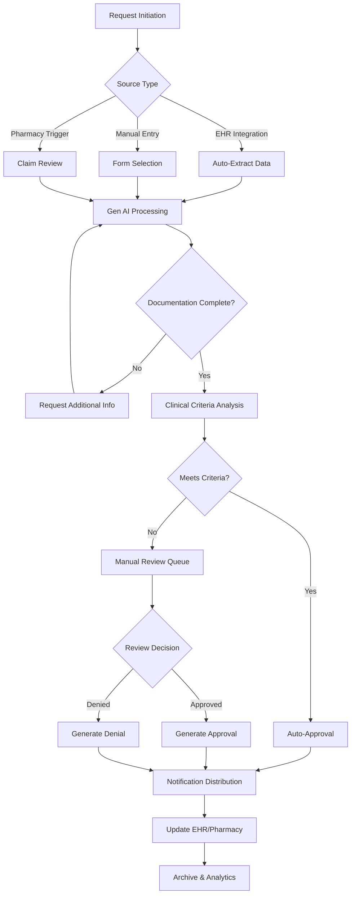
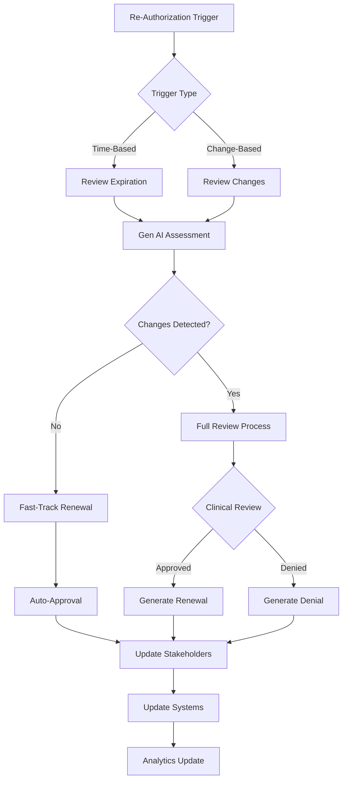
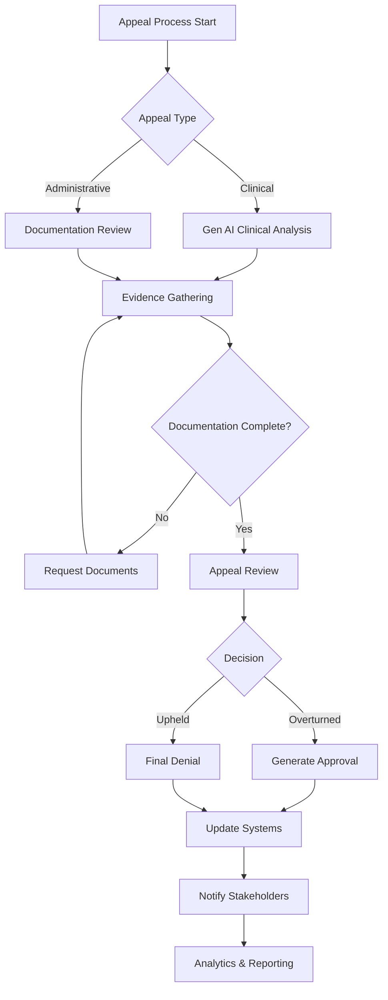
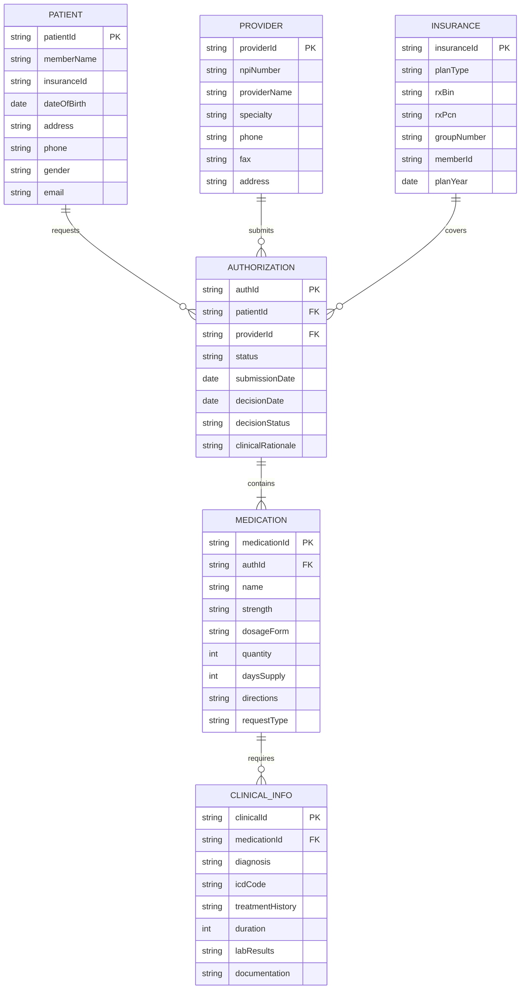
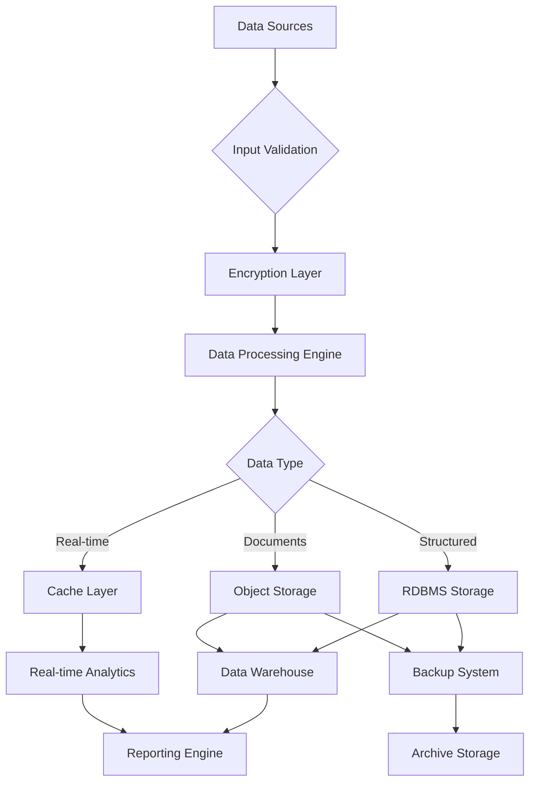

# Product Requirements Document (PRD)

# 1. INTRODUCTION

## 1.1 Purpose
This Software Requirements Specification (SRS) document provides a comprehensive description of the Enhanced Prior Authorization System powered by Generative AI. It serves as the primary reference for technical teams, stakeholders, and development partners involved in building and implementing the system. The document details functional requirements, system behaviors, performance specifications, and technical constraints that must be met to deliver a successful solution.

## 1.2 Scope
The Enhanced Prior Authorization System is a next-generation healthcare software solution designed to revolutionize the medication approval process through artificial intelligence. The system will:

- Automate and streamline prior authorization workflows between healthcare providers, pharmacies, and insurance providers/PBMs
- Implement Generative AI to reduce authorization processing time from days to minutes
- Provide intelligent form processing and validation
- Enable real-time status tracking and stakeholder communications
- Support comprehensive data management for patient, provider, medication, and insurance information
- Ensure regulatory compliance and data security
- Integrate with existing healthcare systems and EHRs
- Deliver analytics and reporting capabilities for process optimization

The system excludes:
- Direct medication dispensing functionality
- Medical billing and claims processing
- Patient scheduling and appointment management
- Clinical decision support for non-medication related treatments
- Direct patient care documentation

# 2. PRODUCT DESCRIPTION

## 2.1 Product Perspective
The Enhanced Prior Authorization System operates as a cloud-based SaaS solution within the broader healthcare ecosystem. It interfaces with:

- Electronic Health Record (EHR) systems
- Pharmacy Management Systems
- Insurance/PBM platforms
- Healthcare provider portals
- Clinical documentation systems
- Regulatory compliance frameworks
- Existing prior authorization databases

The system leverages Generative AI as its core technology while maintaining seamless integration with legacy healthcare infrastructure through standard protocols (HL7, FHIR, NCPDP).

## 2.2 Product Functions
- Automated prior authorization request processing using Gen AI
- Intelligent form identification and auto-population
- Real-time clinical criteria matching and validation
- Smart document extraction and classification
- Multi-stakeholder communication management
- Status tracking and notifications
- Analytics and reporting dashboard
- Audit trail and compliance monitoring
- User role-based access control
- Secure document management
- Integration management with external systems
- Automated re-authorization processing

## 2.3 User Characteristics

### Healthcare Providers
- Technical Proficiency: Moderate
- System Usage: Daily
- Primary Needs: Quick request submission, status tracking
- Access Level: Full clinical documentation, patient records

### Administrative Staff
- Technical Proficiency: High
- System Usage: Continuous
- Primary Needs: Batch processing, workflow management
- Access Level: Limited clinical data, full administrative access

### Insurance/PBM Reviewers
- Technical Proficiency: High
- System Usage: Continuous
- Primary Needs: Review tools, decision support
- Access Level: Full review capabilities, limited patient data

### Pharmacy Staff
- Technical Proficiency: Moderate
- System Usage: Regular
- Primary Needs: Status checks, submission triggers
- Access Level: Medication-related data, limited patient information

### System Administrators
- Technical Proficiency: Expert
- System Usage: As needed
- Primary Needs: System maintenance, user management
- Access Level: Full system access

## 2.4 Constraints

### Technical Constraints
- Must maintain 99.9% uptime
- Maximum response time of 2 seconds for standard operations
- Support for minimum 10,000 concurrent users
- Compliance with HIPAA security requirements
- Data encryption at rest and in transit
- Support for legacy system interfaces

### Regulatory Constraints
- HIPAA/HITECH compliance
- State-specific PA regulations
- Medicare/Medicaid requirements
- FDA guidelines adherence
- Electronic signature requirements
- Data retention policies

### Business Constraints
- Implementation timeline of 18 months
- Training completion for all users within 3 months
- ROI achievement within 24 months
- Maximum system downtime of 1 hour per month
- Budget limitations per approved project scope

## 2.5 Assumptions and Dependencies

### Assumptions
- Healthcare providers have adequate internet connectivity
- Users have basic computer literacy
- EHR systems support standard integration protocols
- Clinical data is available in digital format
- Organizations will provide necessary training resources
- Stakeholders will participate in system testing

### Dependencies
- EHR vendor cooperation for integration
- Insurance/PBM API availability
- Regulatory approval for AI implementation
- Access to clinical databases
- Availability of training environments
- Stakeholder availability for testing
- Network infrastructure reliability
- Third-party service availability
- Data quality from source systems

# 3. PROCESS FLOWCHART

# 4. FUNCTIONAL REQUIREMENTS

## 4.1 Prior Authorization Request Processing

### ID: F-001
### Description
Automated processing of prior authorization requests using Generative AI to extract, validate, and process information from multiple input sources.
### Priority: High
### Requirements

| Requirement ID | Description | Priority |
|---------------|-------------|----------|
| F-001-1 | System shall accept PA requests via EHR integration, manual entry, and pharmacy triggers | High |
| F-001-2 | Gen AI shall automatically extract relevant data from uploaded clinical documents | High |
| F-001-3 | System shall validate all mandatory fields as per data requirements | High |
| F-001-4 | System shall support concurrent processing of multiple PA requests | Medium |
| F-001-5 | System shall maintain audit trail of all processing steps | High |

## 4.2 Form Management

### ID: F-002
### Description
Intelligent form identification, selection, and auto-population capabilities powered by Gen AI.
### Priority: High
### Requirements

| Requirement ID | Description | Priority |
|---------------|-------------|----------|
| F-002-1 | Gen AI shall identify appropriate PA form based on medication and payer | High |
| F-002-2 | System shall auto-populate forms using EHR data and previous submissions | High |
| F-002-3 | System shall support custom form templates for different payers | Medium |
| F-002-4 | System shall validate form completeness before submission | High |
| F-002-5 | System shall maintain version control of form templates | Medium |

## 4.3 Clinical Criteria Matching

### ID: F-003
### Description
Automated analysis of clinical documentation against payer-specific criteria using Gen AI.
### Priority: High
### Requirements

| Requirement ID | Description | Priority |
|---------------|-------------|----------|
| F-003-1 | Gen AI shall extract relevant clinical criteria from documentation | High |
| F-003-2 | System shall maintain updated database of payer-specific criteria | High |
| F-003-3 | System shall provide real-time matching of patient data to criteria | High |
| F-003-4 | System shall identify missing or inadequate clinical documentation | High |
| F-003-5 | System shall suggest alternative medications based on criteria analysis | Medium |

## 4.4 Communication Management

### ID: F-004
### Description
Multi-stakeholder communication system with automated notifications and updates.
### Priority: Medium
### Requirements

| Requirement ID | Description | Priority |
|---------------|-------------|----------|
| F-004-1 | System shall send automated status updates to all stakeholders | High |
| F-004-2 | System shall support secure messaging between stakeholders | Medium |
| F-004-3 | Gen AI shall generate context-aware communication templates | Medium |
| F-004-4 | System shall maintain communication history and audit trail | High |
| F-004-5 | System shall support configurable notification preferences | Low |

## 4.5 Re-Authorization Management

### ID: F-005
### Description
Automated tracking and processing of re-authorization requests with intelligent change detection.
### Priority: Medium
### Requirements

| Requirement ID | Description | Priority |
|---------------|-------------|----------|
| F-005-1 | System shall track PA expiration dates and trigger renewal alerts | High |
| F-005-2 | Gen AI shall identify clinical changes requiring full review | High |
| F-005-3 | System shall support fast-track renewal for unchanged cases | Medium |
| F-005-4 | System shall maintain history of previous authorizations | High |
| F-005-5 | System shall automate re-authorization submission process | Medium |

## 4.6 Analytics and Reporting

### ID: F-006
### Description
Comprehensive analytics dashboard with customizable reports and insights.
### Priority: Medium
### Requirements

| Requirement ID | Description | Priority |
|---------------|-------------|----------|
| F-006-1 | System shall track key performance metrics in real-time | High |
| F-006-2 | System shall generate customizable reports for different stakeholders | Medium |
| F-006-3 | System shall provide trend analysis and predictive insights | Medium |
| F-006-4 | System shall support data export in multiple formats | Low |
| F-006-5 | System shall maintain historical analytics data | Medium |

## 4.7 Integration Management

### ID: F-007
### Description
Seamless integration with external healthcare systems and databases.
### Priority: High
### Requirements

| Requirement ID | Description | Priority |
|---------------|-------------|----------|
| F-007-1 | System shall support HL7 and FHIR integration standards | High |
| F-007-2 | System shall maintain real-time synchronization with EHR systems | High |
| F-007-3 | System shall support NCPDP integration for pharmacy systems | High |
| F-007-4 | System shall provide secure API access for authorized systems | Medium |
| F-007-5 | System shall handle integration error recovery automatically | Medium |

# 5. NON-FUNCTIONAL REQUIREMENTS

## 5.1 Performance Requirements

| Requirement ID | Description | Target Metric |
|---------------|-------------|---------------|
| P-001 | System response time for standard operations | < 2 seconds |
| P-002 | Document upload and processing time | < 30 seconds |
| P-003 | Concurrent user support | 10,000 users |
| P-004 | Database query response time | < 1 second |
| P-005 | Gen AI processing time for form analysis | < 5 seconds |
| P-006 | Batch processing capability | 100,000 requests/hour |
| P-007 | API response time | < 500ms |
| P-008 | Maximum memory usage per session | < 512MB |

## 5.2 Safety Requirements

| Requirement ID | Description | Priority |
|---------------|-------------|----------|
| S-001 | Automated data backup every 4 hours | High |
| S-002 | Redundant system architecture with failover capability | High |
| S-003 | Automatic session timeout after 15 minutes of inactivity | High |
| S-004 | Data recovery point objective (RPO) | < 15 minutes |
| S-005 | Recovery time objective (RTO) | < 1 hour |
| S-006 | Automated system health monitoring and alerts | High |
| S-007 | Disaster recovery plan with alternate site activation | High |
| S-008 | Transaction rollback capabilities for failed operations | High |

## 5.3 Security Requirements

| Requirement ID | Description | Priority |
|---------------|-------------|----------|
| SE-001 | Multi-factor authentication for all users | High |
| SE-002 | End-to-end encryption for data in transit (TLS 1.3) | High |
| SE-003 | AES-256 encryption for data at rest | High |
| SE-004 | Role-based access control (RBAC) implementation | High |
| SE-005 | Security audit logging of all system access | High |
| SE-006 | Regular security penetration testing | High |
| SE-007 | IP-based access restrictions | Medium |
| SE-008 | Automated threat detection and prevention | High |

## 5.4 Quality Requirements

### 5.4.1 Availability
- System uptime: 99.9%
- Planned maintenance windows: < 4 hours/month
- Unplanned downtime: < 1 hour/month
- Service degradation: < 0.1% of operational time

### 5.4.2 Maintainability
- Mean time to repair (MTTR): < 2 hours
- Automated deployment processes
- Modular architecture for easy updates
- Comprehensive system documentation
- Version control for all components

### 5.4.3 Usability
- User training completion time: < 4 hours
- Task completion rate: > 95%
- Error rate: < 1%
- User satisfaction score: > 4.5/5
- Accessibility compliance with WCAG 2.1 Level AA

### 5.4.4 Scalability
- Horizontal scaling capability
- Auto-scaling based on load
- Storage expansion without downtime
- Support for 20% annual growth
- Linear performance with increased load

### 5.4.5 Reliability
- Mean time between failures (MTBF): > 720 hours
- Error handling for all operations
- Data consistency checks
- Automated system health checks
- Fault tolerance for critical components

## 5.5 Compliance Requirements

| Requirement ID | Description | Standard/Regulation |
|---------------|-------------|-------------------|
| C-001 | HIPAA Security Rule compliance | HIPAA |
| C-002 | HITECH Act requirements | HITECH |
| C-003 | SOC 2 Type II certification | AICPA |
| C-004 | HL7 FHIR standards compliance | HL7 |
| C-005 | NCPDP SCRIPT standard support | NCPDP |
| C-006 | FDA 21 CFR Part 11 compliance | FDA |
| C-007 | State-specific PA regulations | Various |
| C-008 | PCI DSS compliance for payment processing | PCI DSS |

# 6. DATA REQUIREMENTS

## 6.1 Data Models

### 6.1.1 Entity Relationship Diagram

## 6.2 Data Storage

### 6.2.1 Storage Requirements
- Primary storage: Distributed NoSQL database for scalability
- Document storage: Object storage for clinical documentation
- Cache layer: In-memory database for frequent access data
- Analytics storage: Data warehouse for reporting and analytics

### 6.2.2 Data Retention
- Active authorizations: Indefinite retention
- Completed authorizations: 7 years minimum
- Clinical documentation: 10 years minimum
- Audit logs: 7 years minimum
- System logs: 1 year minimum

### 6.2.3 Redundancy and Backup
- Real-time replication across multiple availability zones
- Daily incremental backups
- Weekly full backups
- Monthly archive snapshots
- Cross-region backup replication
- 99.999% durability requirement

### 6.2.4 Recovery Requirements
- Recovery Point Objective (RPO): 15 minutes
- Recovery Time Objective (RTO): 1 hour
- Point-in-time recovery capability
- Automated failover mechanisms
- Data consistency verification post-recovery

## 6.3 Data Processing

### 6.3.1 Data Flow Diagram

### 6.3.2 Data Security

| Layer | Security Measure |
|-------|-----------------|
| Transport | TLS 1.3 encryption |
| Storage | AES-256 encryption at rest |
| Processing | Memory encryption |
| Access | Role-based access control |
| Audit | Comprehensive audit logging |
| Compliance | HIPAA-compliant data handling |

### 6.3.3 Data Validation Rules

| Data Type | Validation Rule |
|-----------|----------------|
| Member ID | Alphanumeric, required, unique |
| NPI | 10 digits, checksum validation |
| Dates | ISO 8601 format, future dates restricted |
| Phone Numbers | E.164 format validation |
| Medications | NDC code validation |
| ICD Codes | Current version validation |

### 6.3.4 Data Integration Requirements

| System | Integration Method | Data Format |
|--------|-------------------|-------------|
| EHR | HL7 FHIR | JSON/XML |
| Pharmacy | NCPDP SCRIPT | XML |
| Insurance | EDI 270/271 | X12 |
| Analytics | REST API | JSON |
| Document Management | S3 Compatible | Binary |

# 7. EXTERNAL INTERFACES

## 7.1 User Interfaces

### 7.1.1 Web Application Interface
- Responsive design supporting desktop and tablet devices
- WCAG 2.1 Level AA compliance
- Minimum supported resolutions: 1366x768 (desktop), 768x1024 (tablet)
- Support for Chrome (v90+), Firefox (v85+), Safari (v14+), Edge (v90+)
- Maximum page load time of 2 seconds
- Consistent navigation structure across all pages

### 7.1.2 Mobile Interface
- Progressive Web App (PWA) implementation
- Touch-optimized interface
- Minimum supported resolution: 375x667
- Native-like experience on iOS and Android devices
- Offline capability for form data
- Push notification support

### 7.1.3 Interface Components
- Role-based dashboards
- Dynamic form builder interface
- Document upload interface with drag-and-drop
- Real-time status tracking views
- Interactive analytics dashboard
- Multi-step workflow interface
- Search and filter interfaces

## 7.2 Hardware Interfaces

### 7.2.1 Document Scanning
- TWAIN protocol support
- Resolution: Minimum 300 DPI
- Color depth: 24-bit color, 8-bit grayscale
- Format support: JPEG, PNG, PDF
- Auto-feed scanner compatibility

### 7.2.2 Printing
- Support for network printers via IPP
- PDF generation for all printable documents
- Label printer integration for pharmacy systems
- Barcode scanner compatibility

## 7.3 Software Interfaces

### 7.3.1 EHR Integration
| System Type | Protocol | Data Format | Security |
|-------------|----------|-------------|-----------|
| Epic | HL7 FHIR R4 | JSON/XML | OAuth 2.0 |
| Cerner | HL7 v2.x | HL7 | HTTPS/TLS 1.3 |
| Allscripts | REST API | JSON | JWT |
| NextGen | SOAP | XML | WS-Security |

### 7.3.2 Pharmacy Systems
| System Type | Protocol | Data Format | Security |
|-------------|----------|-------------|-----------|
| Surescripts | NCPDP SCRIPT 2017071 | XML | TLS 1.3 |
| RxHub | NCPDP D.0 | EDI | IPSec VPN |
| Local Systems | REST API | JSON | OAuth 2.0 |

### 7.3.3 Insurance/PBM Systems
| System Type | Protocol | Data Format | Security |
|-------------|----------|-------------|-----------|
| Claims Systems | X12 270/271 | EDI | VPN |
| Formulary | REST API | JSON | OAuth 2.0 |
| Benefits | SOAP | XML | WS-Security |

## 7.4 Communication Interfaces

### 7.4.1 Network Protocols
- HTTPS/TLS 1.3 for all web traffic
- WebSocket for real-time updates
- SMTP/TLS for email communications
- SFTP for batch file transfers
- IPSec VPN for partner connections

### 7.4.2 API Specifications
| Interface Type | Protocol | Format | Rate Limit |
|---------------|----------|---------|------------|
| REST API | HTTPS | JSON | 1000 req/min |
| FHIR API | HTTPS | JSON/XML | 500 req/min |
| WebSocket | WSS | JSON | 100 msg/sec |
| Batch API | SFTP | CSV/XML | 50 MB/file |

### 7.4.3 Messaging Formats
- HL7 v2.x for clinical data
- NCPDP SCRIPT for pharmacy data
- X12 EDI for insurance data
- JSON for API responses
- PDF for documents
- Base64 for binary data

### 7.4.4 Integration Requirements
- Maximum latency: 500ms
- Minimum bandwidth: 10 Mbps
- SSL/TLS encryption required
- Mutual authentication
- Automatic retry mechanism
- Circuit breaker implementation
- Error handling protocols
- Audit logging of all transactions

# 8. APPENDICES

## 8.1 GLOSSARY

| Term | Definition |
|------|------------|
| Prior Authorization | A requirement from insurance companies to approve coverage of certain medications before they can be dispensed |
| Clinical Criteria | Specific medical conditions and requirements that must be met to approve a medication |
| Formulary | A list of prescription drugs covered by an insurance plan |
| Step Therapy | A protocol requiring patients to try less expensive medications before "stepping up" to more costly alternatives |
| Medical Necessity | The determination that a healthcare service is needed for diagnosis, treatment, or management of a medical condition |
| Drug Utilization Review | A program to ensure medications are used appropriately and safely |
| Quantity Limit | Restrictions on the amount of medication covered over a specific time period |
| Off-Label Use | Prescribing a medication for a purpose not approved by the FDA |
| Appeal Process | Formal procedure to request reconsideration of a denied prior authorization |
| Fast-Track Authorization | Expedited review process for urgent medication requests |

## 8.2 ACRONYMS

| Acronym | Full Form |
|---------|-----------|
| PA | Prior Authorization |
| EHR | Electronic Health Record |
| PBM | Pharmacy Benefit Manager |
| Gen AI | Generative Artificial Intelligence |
| HIPAA | Health Insurance Portability and Accountability Act |
| HITECH | Health Information Technology for Economic and Clinical Health Act |
| HL7 | Health Level Seven |
| FHIR | Fast Healthcare Interoperability Resources |
| NCPDP | National Council for Prescription Drug Programs |
| API | Application Programming Interface |
| NPI | National Provider Identifier |
| ICD | International Classification of Diseases |
| NDC | National Drug Code |
| ROI | Return on Investment |
| SLA | Service Level Agreement |
| RBAC | Role-Based Access Control |
| RPO | Recovery Point Objective |
| RTO | Recovery Time Objective |
| SSL | Secure Sockets Layer |
| TLS | Transport Layer Security |

## 8.3 ADDITIONAL REFERENCES

| Reference Type | Description | URL/Location |
|---------------|-------------|--------------|
| HL7 FHIR Documentation | Implementation guide for FHIR integration | https://www.hl7.org/fhir/ |
| NCPDP Standards | SCRIPT Standard Implementation Guide | https://www.ncpdp.org/Standards |
| HIPAA Guidelines | Security and Privacy Rules | https://www.hhs.gov/hipaa |
| FDA Guidelines | Electronic Records Requirements | https://www.fda.gov/regulatory-information |
| State PA Laws | Database of state-specific PA requirements | Various state healthcare websites |
| Clinical Guidelines | Evidence-based prescribing guidelines | Professional medical associations |
| Security Standards | NIST Cybersecurity Framework | https://www.nist.gov/cyberframework |
| AI/ML Resources | Best practices for healthcare AI implementation | Industry whitepapers |