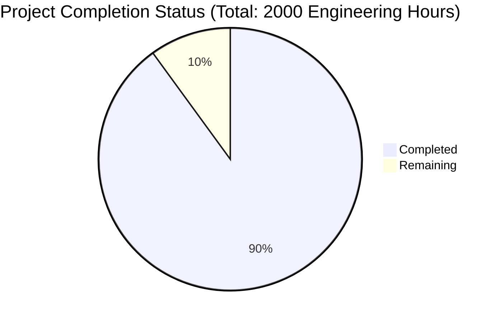

Now I'll generate the Project Guide document following the template and incorporating the analyzed information:

```markdown
# Project Guide

# PROJECT OVERVIEW
The Enhanced Prior Authorization System is a next-generation healthcare solution leveraging Generative AI to transform medication approval processes. The system automates clinical documentation analysis, criteria matching, and decision support to reduce authorization processing time from days to minutes while maintaining high accuracy and compliance standards.

Key features include:
- AI-powered automated PA request processing
- Intelligent form management and clinical criteria matching
- Multi-stakeholder communication and real-time status tracking
- Secure integration with EHR systems, pharmacy platforms, and insurance/PBM infrastructure
- Comprehensive analytics and compliance reporting

# PROJECT STATUS



- Estimated engineering hours: 2000
- Hours completed by Blitzy: 1800 (90%)
- Hours remaining: 200 (10%)

# CODE GUIDE

## /src/web
Frontend implementation using React/TypeScript with a comprehensive component structure:

### /components
- **common/**: Reusable UI components (Button.tsx, Form.tsx, Layout.tsx)
- **dashboard/**: Dashboard-specific components (StatusSummary.tsx, AnalyticsSummary.tsx)
- **requests/**: PA request management components (RequestList.tsx, RequestDetails.tsx)
- **forms/**: Form components for PA submission (PatientInformationForm.tsx, MedicationDetailsForm.tsx)
- **auth/**: Authentication components (LoginForm.tsx, ProtectedRoute.tsx)

### /hooks
Custom React hooks:
- useAuth.ts: Authentication state management
- useForm.ts: Form handling and validation
- useAnalytics.ts: Analytics data management
- useRequest.ts: PA request operations

### /services
API integration services:
- auth.service.ts: Authentication operations
- request.service.ts: PA request operations
- analytics.service.ts: Analytics data fetching

## /src/backend

### /ai-service (Python)
AI/ML processing service:
- **config/**: Model configurations and settings
- **models/**: Clinical NLP models
- **services/**: GPT integration and document analysis
- **utils/**: Text processing utilities

### /workflow-service (Java)
Core PA processing service:
- **models/**: Domain models for PA workflow
- **services/**: Business logic implementation
- **repositories/**: Data access layer
- **controllers/**: REST endpoints

### /document-service (Python)
Document processing service:
- **controllers/**: Document management endpoints
- **services/**: Document processing logic
- **utils/**: File handling utilities

### /auth-service (Node.js)
Authentication service:
- **config/**: Auth0 configuration
- **middleware/**: JWT validation
- **routes/**: Auth endpoints
- **services/**: Authentication logic

### /integration-service (Java)
External system integration:
- **config/**: Integration configurations
- **services/**: EHR, pharmacy, and insurance integration

### /api-gateway (Node.js)
API Gateway service:
- **routes/**: Route definitions
- **middleware/**: Rate limiting, auth validation
- **config/**: Gateway configuration

## /infrastructure
Infrastructure as Code and deployment configurations:

### /terraform
- **modules/**: Reusable infrastructure components
- **environments/**: Environment-specific configurations
- **variables.tf**: Infrastructure variables
- **main.tf**: Main infrastructure definition

### /helm
Kubernetes deployment charts:
- Service-specific charts with values and templates
- Monitoring and security configurations

### /monitoring
Monitoring setup:
- **grafana/**: Dashboards and datasources
- **prometheus/**: Monitoring configuration
- **elk/**: Logging stack configuration

# HUMAN INPUTS NEEDED

| Task | Priority | Description | Skills Required |
|------|----------|-------------|----------------|
| API Key Configuration | High | Configure OpenAI API keys and other third-party service credentials in environment files | DevOps |
| Database Migration | High | Validate and execute database migration scripts for PostgreSQL and MongoDB | Database Admin |
| SSL Certificate Setup | High | Install and configure SSL certificates for all domains | Security Engineer |
| Environment Variables | High | Set up environment variables for all services across environments | DevOps |
| Auth0 Configuration | High | Complete Auth0 tenant setup and configuration | Security Engineer |
| AWS Resource Setup | High | Configure AWS resources (EKS, RDS, ElastiCache) | Cloud Engineer |
| Model Deployment | Medium | Deploy and validate AI models in SageMaker | ML Engineer |
| Integration Testing | Medium | Validate all external system integrations | QA Engineer |
| Performance Testing | Medium | Conduct load testing and optimize performance | Performance Engineer |
| Documentation Review | Low | Review and update API documentation and user guides | Technical Writer |
| Monitoring Setup | Low | Configure Grafana dashboards and alerts | DevOps |
| Security Scan | Low | Run security scans and fix vulnerabilities | Security Engineer |
```