# Technical Specifications

# 1. INTRODUCTION

## 1.1 EXECUTIVE SUMMARY

The Enhanced Prior Authorization System represents a next-generation healthcare solution leveraging Generative AI to transform the medication approval process. This system addresses the critical challenge of lengthy prior authorization processing times that currently delay patient care and burden healthcare providers. By automating clinical documentation analysis, criteria matching, and decision support, the system aims to reduce authorization processing time from days to minutes while maintaining high accuracy and compliance standards.

The solution will serve multiple stakeholder groups including healthcare providers, administrative staff, insurance reviewers, and pharmacy personnel, delivering measurable improvements in operational efficiency, cost reduction, and patient care delivery. With projected improvements of 80% in processing time and 90% in first-pass approval rates, the system promises significant return on investment for healthcare organizations.

## 1.2 SYSTEM OVERVIEW

### Project Context

| Aspect | Description |
|--------|-------------|
| Business Context | First-to-market AI-powered PA solution targeting enterprise healthcare organizations |
| Current Limitations | Manual processing, high error rates, lengthy approval times, poor stakeholder communication |
| Enterprise Integration | Seamless integration with EHR systems, pharmacy platforms, and insurance/PBM infrastructure |

### High-Level Description

| Component | Details |
|-----------|----------|
| Primary Capabilities | - Automated PA request processing<br>- Intelligent form management<br>- Clinical criteria matching<br>- Multi-stakeholder communication<br>- Real-time status tracking |
| Architecture | Cloud-based SaaS solution with distributed microservices architecture |
| Core Technology | Gen AI-powered processing engine with machine learning capabilities |
| Integration Framework | HL7 FHIR, NCPDP SCRIPT, REST APIs |

### Success Criteria

| Metric | Target |
|--------|---------|
| Processing Time | 80% reduction |
| First-Pass Approval | 90% success rate |
| Error Rate | < 1% |
| User Adoption | 95% within 6 months |
| Cost Reduction | 60% decrease in administrative costs |

## 1.3 SCOPE

### In-Scope Elements

#### Core Features

| Category | Components |
|----------|------------|
| Request Processing | - Multi-channel request intake<br>- Automated document analysis<br>- Clinical criteria matching<br>- Decision support |
| Workflow Management | - Status tracking<br>- Task routing<br>- Notification system<br>- Appeal processing |
| Integration | - EHR systems<br>- Pharmacy platforms<br>- Insurance/PBM systems<br>- Clinical databases |
| Reporting | - Real-time analytics<br>- Compliance reporting<br>- Performance metrics<br>- Audit trails |

#### Implementation Boundaries

| Boundary Type | Coverage |
|--------------|----------|
| User Groups | Healthcare providers, administrative staff, insurance reviewers, pharmacy personnel |
| Geographic Scope | United States healthcare market |
| Data Domains | Patient demographics, clinical data, medication information, insurance details |
| Compliance | HIPAA, HITECH, FDA, State PA regulations |

### Out-of-Scope Elements

| Category | Excluded Elements |
|----------|------------------|
| Clinical Systems | - Medical billing/claims processing<br>- Patient scheduling<br>- Clinical decision support for non-medication treatments |
| Pharmacy Operations | - Medication dispensing<br>- Inventory management<br>- Point-of-sale systems |
| Future Capabilities | - International markets<br>- Mobile prescription management<br>- Direct patient portal access<br>- Real-time benefit verification |
| Technical Elements | - Legacy system maintenance<br>- Non-healthcare integrations<br>- Custom hardware requirements<br>- Non-standard data formats |

# 2. SYSTEM ARCHITECTURE

## 2.1 High-Level Architecture


## 2.2 Container Architecture


## 2.3 Component Architecture


## 2.4 Component Details

| Component | Technology Stack | Purpose | Scaling Strategy |
|-----------|-----------------|---------|------------------|
| Web Portal | React, TypeScript | User interface | Horizontal with CDN |
| API Gateway | Kong | Request routing, auth | Horizontal with DNS |
| Auth Service | Node.js, JWT | Authentication | Horizontal stateless |
| Workflow Service | Java Spring | Core PA processing | Horizontal with sharding |
| Document Service | Python FastAPI | Document handling | Vertical with GPU |
| AI Service | Python, TensorFlow | Gen AI processing | Vertical with GPU |
| Integration Service | Java Spring | External systems | Horizontal stateless |

## 2.5 Technical Decisions

### Architecture Style
- Microservices architecture for:
  - Independent scaling
  - Technology flexibility
  - Fault isolation
  - Deployment autonomy

### Communication Patterns
- Synchronous (REST/gRPC):
  - User-facing operations
  - Critical path workflows
- Asynchronous (Event-driven):
  - Document processing
  - AI analysis
  - Notifications
  - Integration updates

### Data Storage
| Store Type | Technology | Purpose |
|------------|------------|---------|
| Primary DB | PostgreSQL | Transactional data |
| Document Store | MongoDB | Clinical documents |
| Cache | Redis | Session, temp data |
| Queue | RabbitMQ | Event processing |
| Object Storage | S3 | Document archival |

## 2.6 Cross-Cutting Concerns


## 2.7 Deployment Architecture

```mermaid
C4Deployment
    title Deployment Diagram - Production Environment

    Deployment_Node(cdn, "CDN", "CloudFront") {
        Container(static, "Static Assets")
    }
    
    Deployment_Node(az1, "Availability Zone 1") {
        Deployment_Node(k8s1, "Kubernetes Cluster") {
            Container(services1, "Microservices")
        }
        Deployment_Node(db1, "Database Cluster") {
            ContainerDb(pg1, "PostgreSQL Primary")
        }
    }
    
    Deployment_Node(az2, "Availability Zone 2") {
        Deployment_Node(k8s2, "Kubernetes Cluster") {
            Container(services2, "Microservices")
        }
        Deployment_Node(db2, "Database Cluster") {
            ContainerDb(pg2, "PostgreSQL Replica")
        }
    }
    
    Rel(cdn, k8s1, "Routes traffic")
    Rel(cdn, k8s2, "Routes traffic")
    Rel(pg1, pg2, "Replication")
```

# 3. SYSTEM COMPONENTS ARCHITECTURE

## 3.1 USER INTERFACE DESIGN

### 3.1.1 Design Specifications

| Category | Requirements |
|----------|--------------|
| Visual Hierarchy | - F-pattern layout for forms<br>- Z-pattern for dashboards<br>- Progressive disclosure for complex workflows |
| Design System | - Material Design 3.0 based components<br>- Consistent 8px grid system<br>- Healthcare-optimized color palette |
| Responsiveness | - Desktop-first (1920px, 1440px, 1280px)<br>- Tablet breakpoint (1024px)<br>- Mobile breakpoint (375px) |
| Accessibility | - WCAG 2.1 Level AA compliance<br>- ARIA landmarks and labels<br>- Keyboard navigation support |
| Browser Support | - Chrome 90+<br>- Firefox 85+<br>- Safari 14+<br>- Edge 90+ |
| Theming | - Light/Dark mode toggle<br>- Organization-specific theming<br>- High contrast mode |
| i18n/l10n | - English (US) primary<br>- Spanish language support<br>- RTL layout support |

### 3.1.2 Critical User Flows


### 3.1.3 Component Library

| Component | Variants | States | Validation |
|-----------|----------|---------|------------|
| Form Fields | Text, Select, Date, File | Default, Focus, Error, Disabled | Required, Format, Range |
| Buttons | Primary, Secondary, Tertiary | Default, Hover, Active, Loading | Permission-based |
| Tables | Standard, Compact, Expandable | Sortable, Filterable, Paginated | Data loading |
| Modals | Standard, Large, Full-screen | Open, Close, Loading | Escape key support |
| Notifications | Success, Warning, Error, Info | Dismissible, Timed, Persistent | Priority levels |

## 3.2 DATABASE DESIGN

### 3.2.1 Schema Design

```mermaid
erDiagram
    AUTHORIZATION {
        uuid id PK
        uuid patient_id FK
        uuid provider_id FK
        string status
        timestamp created_at
        timestamp updated_at
        jsonb metadata
    }
    
    CLINICAL_DATA {
        uuid id PK
        uuid auth_id FK
        string diagnosis_code
        string treatment_history
        jsonb lab_results
        timestamp recorded_at
    }
    
    DOCUMENTS {
        uuid id PK
        uuid auth_id FK
        string type
        string status
        string storage_path
        timestamp uploaded_at
    }
    
    AUDIT_LOG {
        uuid id PK
        uuid auth_id FK
        uuid user_id FK
        string action
        jsonb changes
        timestamp occurred_at
    }
    
    AUTHORIZATION ||--o{ CLINICAL_DATA : contains
    AUTHORIZATION ||--o{ DOCUMENTS : includes
    AUTHORIZATION ||--o{ AUDIT_LOG : tracks
```



### 3.2.2 Data Management Strategy

| Aspect | Implementation |
|--------|----------------|
| Partitioning | - Time-based partitioning for audit logs<br>- Hash partitioning for authorizations<br>- Range partitioning for clinical data |
| Indexing | - B-tree indexes for lookups<br>- GiST indexes for document search<br>- Partial indexes for active records |
| Archival | - 90-day active retention<br>- 7-year cold storage<br>- Automated archival process |
| Backup | - Hourly incremental backups<br>- Daily full backups<br>- Cross-region replication |
| Security | - Row-level security<br>- Column-level encryption<br>- Audit logging |

## 3.3 API DESIGN

### 3.3.1 API Architecture


### 3.3.2 API Specifications

| Category | Specification |
|----------|--------------|
| Protocol | REST over HTTPS |
| Auth | OAuth 2.0 + JWT |
| Format | JSON (HAL+JSON for HATEOAS) |
| Versioning | URI versioning (v1, v2) |
| Rate Limits | 1000 req/min per client |
| Documentation | OpenAPI 3.0 Specification |

### 3.3.3 Endpoint Structure

| Endpoint | Method | Purpose | Rate Limit |
|----------|--------|---------|------------|
| /api/v1/authorizations | POST | Create new PA request | 100/min |
| /api/v1/authorizations/{id} | GET | Retrieve PA details | 1000/min |
| /api/v1/authorizations/{id}/documents | POST | Upload documents | 200/min |
| /api/v1/authorizations/{id}/status | PATCH | Update status | 500/min |
| /api/v1/authorizations/search | GET | Search requests | 300/min |

### 3.3.4 Integration Patterns


# 4. TECHNOLOGY STACK

## 4.1 PROGRAMMING LANGUAGES

| Layer | Language | Version | Justification |
|-------|----------|---------|---------------|
| Frontend | TypeScript | 5.0+ | Type safety, enterprise scalability |
| Web API | Java | 17 LTS | Enterprise support, performance |
| Document Processing | Python | 3.11+ | ML libraries, document handling |
| AI Services | Python | 3.11+ | Gen AI frameworks, ML ecosystem |
| Integration Services | Java | 17 LTS | Enterprise connectivity |
| Mobile | Kotlin/Swift | Latest | Native performance |

## 4.2 FRAMEWORKS & LIBRARIES

### Frontend
| Framework | Version | Purpose |
|-----------|---------|---------|
| React | 18.2+ | Component-based UI |
| Material UI | 5.x | Healthcare-optimized components |
| Redux Toolkit | 1.9+ | State management |
| React Query | 4.x | Data fetching/caching |
| React Hook Form | 7.x | Form validation |

### Backend
| Framework | Version | Purpose |
|-----------|---------|---------|
| Spring Boot | 3.x | Core application framework |
| Spring Security | 6.x | Authentication/authorization |
| Spring Cloud | 2023.x | Microservices support |
| FastAPI | 0.100+ | AI service endpoints |
| LangChain | 0.0.27+ | Gen AI orchestration |

## 4.3 DATABASES & STORAGE


## 4.4 THIRD-PARTY SERVICES

| Category | Service | Purpose |
|----------|---------|---------|
| Authentication | Auth0 | Identity management |
| Monitoring | Datadog | Application monitoring |
| APM | New Relic | Performance monitoring |
| AI Services | OpenAI API | Gen AI capabilities |
| Email | SendGrid | Notification delivery |
| SMS | Twilio | Mobile notifications |
| Analytics | Snowflake | Data warehouse |
| CDN | Cloudflare | Content delivery |

## 4.5 DEVELOPMENT & DEPLOYMENT


### Development Tools
| Tool | Version | Purpose |
|------|---------|---------|
| IntelliJ IDEA | Latest | Java development |
| VS Code | Latest | Frontend/Python |
| Docker Desktop | Latest | Local containers |
| Postman | Latest | API testing |
| Git | Latest | Version control |

### Build & Deploy
| Tool | Version | Purpose |
|------|---------|---------|
| Maven | 3.9+ | Java builds |
| npm | 9+ | Frontend builds |
| Docker | 24+ | Containerization |
| Kubernetes | 1.27+ | Orchestration |
| ArgoCD | 2.8+ | GitOps deployment |

# 5. SYSTEM DESIGN

## 5.1 USER INTERFACE DESIGN

### 5.1.1 Layout Structure


### 5.1.2 Key Screens

| Screen | Primary Components | Actions |
|--------|-------------------|---------|
| Dashboard | - Status summary cards<br>- Priority queue<br>- Recent activities<br>- Quick actions | View, Filter, Sort |
| PA Request Form | - Smart form fields<br>- Document upload<br>- Clinical criteria matcher<br>- Validation indicators | Submit, Save, Cancel |
| Request Details | - Request timeline<br>- Document viewer<br>- Status updates<br>- Communication panel | Update, Approve, Deny |
| Analytics | - Performance metrics<br>- Trend charts<br>- Filter controls<br>- Export options | Filter, Export, Share |

## 5.2 DATABASE DESIGN

### 5.2.1 Core Schema


### 5.2.2 Data Access Patterns

| Access Pattern | Implementation | Indexing Strategy |
|----------------|----------------|-------------------|
| Request Lookup | Hash key on ID | B-tree primary index |
| Status Updates | Optimistic locking | Partial index on status |
| Document Search | Full-text search | GiST index on metadata |
| Audit Trail | Append-only log | Time-based partitioning |
| Analytics Queries | Materialized views | Composite indexes |

## 5.3 API DESIGN

### 5.3.1 REST Endpoints

| Endpoint | Method | Purpose | Request/Response |
|----------|---------|---------|------------------|
| /api/v1/authorizations | POST | Create PA request | Request body: PA details<br>Response: Request ID |
| /api/v1/authorizations/{id} | GET | Retrieve PA details | Response: Full PA record |
| /api/v1/authorizations/{id}/documents | POST | Upload documents | Request: Multipart form<br>Response: Document IDs |
| /api/v1/authorizations/{id}/status | PATCH | Update status | Request: Status change<br>Response: Updated status |
| /api/v1/authorizations/search | GET | Search requests | Query params: filters<br>Response: Paginated results |

### 5.3.2 Integration Flow


### 5.3.3 Event Streams

| Event Type | Producer | Consumers | Payload |
|------------|----------|-----------|----------|
| RequestCreated | Workflow Service | Notification, Analytics | Request details |
| DocumentUploaded | Document Service | AI Service, Archive | Document metadata |
| StatusChanged | Workflow Service | Notification, EHR Integration | Status update |
| DecisionMade | Review Service | Notification, Analytics | Decision details |
| CriteriaMatched | AI Service | Workflow Service | Match results |

### 5.3.4 Error Handling


# 6. USER INTERFACE DESIGN

## 6.1 Design System

### Component Key
```
Icons:
[?] - Help/Information tooltip
[$] - Payment/Financial information
[i] - General information
[+] - Add new item
[x] - Close/Delete
[<] [>] - Navigation
[^] - Upload document
[#] - Dashboard menu
[@] - User profile
[!] - Alert/Warning
[=] - Settings menu
[*] - Important/Favorite

Input Elements:
[ ] - Checkbox
( ) - Radio button
[...] - Text input field
[v] - Dropdown menu
[Button] - Action button
[====] - Progress indicator
```

## 6.2 Main Dashboard

```
+--------------------------------------------------+
|  Enhanced PA System             [@User] [?] [=]   |
+--------------------------------------------------+
|  [#] Dashboard                                    |
|  +-- Requests                   [+ New Request]   |
|  +-- Analytics                                    |
|  +-- Settings                                     |
+------------------+-------------------------------+
|                  |                               |
| Active Requests  | Quick Actions                 |
| [====] 12/15     | [Button] Start New Request    |
|                  | [Button] Search Requests      |
| Pending Review   | [Button] View Analytics       |
| [====] 8/20      |                               |
|                  | Recent Activities             |
| Approved Today   | > PA-2024-001 Approved       |
| [====] 25/30     | > PA-2024-002 Pending Docs   |
|                  | > PA-2024-003 Under Review    |
+------------------+-------------------------------+
```

## 6.3 New Request Form

```
+--------------------------------------------------+
|  New Prior Authorization         [@User] [?] [=]  |
+--------------------------------------------------+
| [< Back to Dashboard]                             |
|                                                   |
| Patient Information                               |
| Name: [............] DOB: [MM/DD/YYYY]           |
| ID#:  [............] Gender: [v]                 |
| Phone:[............] Email: [............]       |
|                                                   |
| Insurance Details                                 |
| Plan: [v] ID#: [...........] Group#: [........] |
|                                                   |
| Medication Details                                |
| Name: [v]                                        |
| Strength: [v] Form: [v] Quantity: [...]          |
| Days Supply: [...] Directions: [............]    |
|                                                   |
| Clinical Information                             |
| Diagnosis: [v]  ICD-10: [........]              |
| [^] Upload Clinical Documents                    |
|                                                   |
| [Save Draft] [Submit Request]                    |
+--------------------------------------------------+
```

## 6.4 Request Details View

```
+--------------------------------------------------+
|  Request PA-2024-001             [@User] [?] [=] |
+--------------------------------------------------+
| Status: [!] Pending Additional Documentation      |
|                                                  |
| +---------------+------------------------------+  |
| | Request Info  | Timeline                    |  |
| |               | 01/15 - Request Created     |  |
| | Patient:      | 01/15 - Documents Uploaded  |  |
| | John Doe      | 01/16 - Under Review       |  |
| | ID: 12345     | [!] Pending Documents      |  |
| |               |                            |  |
| | Medication:   | Required Actions           |  |
| | Drug XYZ      | [^] Upload Lab Results     |  |
| | 50mg daily    | [^] Upload Chart Notes     |  |
| |               |                            |  |
| | Provider:     | Comments                   |  |
| | Dr. Smith     | [...........................|  |
| | NPI: 1234567  | [Add Comment]              |  |
| +---------------+------------------------------+  |
|                                                  |
| [Update Status] [Cancel Request] [Print]         |
+--------------------------------------------------+
```

## 6.5 Analytics Dashboard

```
+--------------------------------------------------+
|  Analytics Overview             [@User] [?] [=]   |
+--------------------------------------------------+
| Time Period: [v Last 30 Days]    [Export Data]   |
|                                                  |
| +----------------+  +----------------+           |
| | Approval Rate  |  | Processing Time|           |
| | [====] 85%     |  | [====] 2.5 hrs |           |
| +----------------+  +----------------+           |
|                                                  |
| Request Volume                                   |
| +-------------------------------------------+   |
| |  ^                                        |   |
| |  |    *     *                            |   |
| |  |  *   * *   *    *                     |   |
| |  |*     *       * *   *                  |   |
| |  +---------------------------------------|   |
| |  01  05  10  15  20  25  30             |   |
| +-------------------------------------------+   |
|                                                 |
| Top Medications         Status Distribution     |
| 1. Drug ABC [====]     [ ] Approved   (45%)    |
| 2. Drug XYZ [===]      [ ] Pending    (30%)    |
| 3. Drug 123 [==]       [ ] Denied     (25%)    |
+--------------------------------------------------+
```

## 6.6 Responsive Design Breakpoints

| Breakpoint | Width | Layout Adjustments |
|------------|-------|-------------------|
| Desktop | 1920px | Full layout with side panels |
| Laptop | 1440px | Condensed side panels |
| Tablet | 1024px | Stacked layout, collapsible menu |
| Mobile | 375px | Single column, hamburger menu |

## 6.7 Accessibility Features

| Feature | Implementation |
|---------|---------------|
| Color Contrast | WCAG 2.1 AA compliant (4.5:1 minimum) |
| Keyboard Navigation | Full tab index support |
| Screen Readers | ARIA labels and landmarks |
| Text Scaling | Supports 200% zoom without loss of functionality |
| Error Indicators | Color + icon + text for all alerts |
| Focus Indicators | High visibility focus states |

## 6.8 Theme Configuration

| Element | Light Theme | Dark Theme |
|---------|------------|------------|
| Background | #FFFFFF | #1A1A1A |
| Primary Text | #333333 | #FFFFFF |
| Secondary Text | #666666 | #CCCCCC |
| Primary Action | #0066CC | #3399FF |
| Success | #28A745 | #34D058 |
| Warning | #FFC107 | #FFD700 |
| Error | #DC3545 | #FF4D4D |

# 7. SECURITY CONSIDERATIONS

## 7.1 AUTHENTICATION AND AUTHORIZATION

### 7.1.1 Authentication Methods

| Method | Implementation | Use Case |
|--------|---------------|-----------|
| OAuth 2.0 + OIDC | Auth0 integration | Primary SSO authentication |
| SAML 2.0 | Enterprise IdP support | Healthcare organization SSO |
| MFA | Time-based OTP | Additional security layer |
| API Keys | JWT with RS256 | Service-to-service auth |
| Biometric | Mobile device integration | Mobile app access |

### 7.1.2 Role-Based Access Control (RBAC)


### 7.1.3 Permission Matrix

| Role | View Requests | Submit Requests | Approve/Deny | Admin Functions | Clinical Data |
|------|--------------|-----------------|--------------|-----------------|---------------|
| Healthcare Provider | ✓ | ✓ | - | - | ✓ |
| Insurance Reviewer | ✓ | - | ✓ | - | Limited |
| Admin Staff | ✓ | ✓ | - | - | Limited |
| Pharmacy Staff | ✓ | ✓ | - | - | Limited |
| System Admin | ✓ | ✓ | ✓ | ✓ | ✓ |

## 7.2 DATA SECURITY

### 7.2.1 Encryption Standards

| Data State | Method | Standard |
|------------|--------|----------|
| In Transit | TLS 1.3 | FIPS 140-2 |
| At Rest | AES-256 | FIPS 140-2 |
| Database | Column-level | AES-256 |
| Backups | AES-256 | FIPS 140-2 |
| Key Storage | HSM | FIPS 140-2 |

### 7.2.2 Data Classification


### 7.2.3 PHI/PII Protection

| Protection Layer | Implementation | Monitoring |
|-----------------|----------------|------------|
| Access Control | Role-based + MFA | Real-time alerts |
| Data Masking | Dynamic masking | Audit logs |
| Tokenization | Sensitive fields | Usage tracking |
| Audit Logging | All PHI access | Daily review |
| Data Retention | Automated policies | Compliance checks |

## 7.3 SECURITY PROTOCOLS

### 7.3.1 Network Security


### 7.3.2 Security Monitoring

| Component | Tool | Purpose |
|-----------|------|---------|
| SIEM | Datadog Security | Log analysis & alerts |
| IDS/IPS | AWS Shield | Threat detection |
| Vulnerability Scanning | Qualys | Weekly scans |
| Penetration Testing | Third-party | Quarterly tests |
| Security Analytics | Custom dashboard | Real-time monitoring |

### 7.3.3 Incident Response


### 7.3.4 Compliance Controls

| Requirement | Implementation | Validation |
|-------------|----------------|------------|
| HIPAA | Access controls, encryption | Annual audit |
| HITECH | Breach notification | Quarterly review |
| SOC 2 | Security policies | Annual certification |
| FDA 21 CFR Part 11 | Electronic signatures | Validation testing |
| State Regulations | Custom controls | Regular assessment |

# 8. INFRASTRUCTURE

## 8.1 DEPLOYMENT ENVIRONMENT

### Primary Production Environment

| Component | Environment Type | Justification |
|-----------|-----------------|---------------|
| Core Services | Cloud-Native | Scalability, reliability, global reach |
| Data Storage | Cloud with Regional Replication | Data sovereignty, performance |
| AI Processing | Cloud with GPU Support | Cost-effective ML processing |
| Cache Layer | Distributed Cloud | Low-latency access |
| Backup Systems | Multi-Region Cloud | Disaster recovery |

### Development/Testing Environments

| Environment | Purpose | Infrastructure |
|-------------|---------|---------------|
| Development | Feature development | Containerized local/cloud |
| Integration | System integration testing | Scaled-down cloud replica |
| Staging | Pre-production validation | Production mirror |
| DR | Business continuity | Secondary region |

## 8.2 CLOUD SERVICES


### Service Selection Justification

| Service Category | Selected Service | Justification |
|-----------------|------------------|---------------|
| Container Orchestration | EKS | Native K8s support, scalability |
| Object Storage | S3 | HIPAA compliance, durability |
| Relational Database | RDS PostgreSQL | Enterprise reliability, HIPAA compliance |
| Document Database | DocumentDB | MongoDB compatibility, managed service |
| Cache | ElastiCache Redis | High performance, cluster support |
| AI/ML | SageMaker | Custom model deployment, scalability |
| Security | WAF, KMS, Secrets Manager | Healthcare-grade security |

## 8.3 CONTAINERIZATION

### Container Strategy

```mermaid
flowchart LR
    A[Base Images] --> B[Service Images]
    B --> C[Development]
    B --> D[Testing]
    B --> E[Production]
    
    F[Image Registry] --> G[ECR]
    G --> C
    G --> D
    G --> E
    
    H[Security Scanning] --> I[Image Validation]
    I --> C
    I --> D
    I --> E
```

### Container Configuration

| Component | Base Image | Resource Limits |
|-----------|------------|-----------------|
| Web Portal | node:18-alpine | CPU: 2, Memory: 4Gi |
| API Gateway | kong:3.0 | CPU: 4, Memory: 8Gi |
| Auth Service | node:18-alpine | CPU: 2, Memory: 4Gi |
| Workflow Service | amazoncorretto:17 | CPU: 4, Memory: 8Gi |
| Document Service | python:3.11-slim | CPU: 4, Memory: 8Gi |
| AI Service | pytorch/pytorch:2.0 | CPU: 8, Memory: 16Gi, GPU: 1 |

## 8.4 ORCHESTRATION

### Kubernetes Architecture

```mermaid
flowchart TD
    A[EKS Control Plane] --> B[Node Groups]
    B --> C[General Purpose]
    B --> D[CPU Optimized]
    B --> E[GPU Nodes]
    
    F[Service Mesh] --> G[App Services]
    G --> H[Ingress]
    G --> I[Core Services]
    G --> J[Background Jobs]
    
    K[Monitoring] --> L[Prometheus]
    K --> M[Grafana]
    K --> N[Alert Manager]
```

### Cluster Configuration

| Component | Configuration | Purpose |
|-----------|--------------|---------|
| Control Plane | Multi-AZ | High availability |
| Node Groups | Auto-scaling | Resource optimization |
| Service Mesh | Istio | Traffic management, security |
| Ingress | AWS ALB | Load balancing, SSL termination |
| Storage Classes | EBS, EFS | Persistent storage |
| Network Policy | Calico | Network security |

## 8.5 CI/CD PIPELINE

### Pipeline Architecture

```mermaid
flowchart LR
    A[Source Code] --> B[Build]
    B --> C[Test]
    C --> D[Security Scan]
    D --> E[Artifact Creation]
    E --> F[Deploy to Dev]
    F --> G[Integration Tests]
    G --> H[Deploy to Staging]
    H --> I[E2E Tests]
    I --> J[Production Deploy]
    
    K[GitOps] --> L[ArgoCD]
    L --> F
    L --> H
    L --> J
```

### Pipeline Components

| Stage | Tools | Purpose |
|-------|-------|---------|
| Source Control | GitHub Enterprise | Version control |
| Build | GitHub Actions | CI automation |
| Testing | Jest, JUnit, PyTest | Automated testing |
| Security | Snyk, SonarQube | Code/container scanning |
| Artifact Storage | ECR, S3 | Image/artifact storage |
| Deployment | ArgoCD | GitOps deployment |
| Monitoring | Datadog | Pipeline monitoring |

### Deployment Strategy

| Environment | Strategy | Rollback Plan |
|-------------|----------|---------------|
| Development | Direct Deploy | Immediate revert |
| Staging | Blue/Green | Environment switch |
| Production | Canary | Gradual rollout/rollback |
| DR | Multi-region | Region failover |

# APPENDICES

## A.1 ADDITIONAL TECHNICAL INFORMATION

### A.1.1 Gen AI Model Specifications

| Component | Specification | Purpose |
|-----------|--------------|----------|
| Base Model | GPT-4 | Clinical text understanding |
| Fine-tuning Dataset | 1M+ PA records | Domain specialization |
| Input Tokens | 8,192 max | Document processing |
| Output Tokens | 4,096 max | Response generation |
| Inference Time | < 1 second | Real-time processing |
| Model Hosting | SageMaker | Scalable deployment |

### A.1.2 Integration Protocols

```mermaid
flowchart TD
    A[Integration Layer] --> B{Protocol Type}
    B -->|Clinical| C[HL7/FHIR]
    B -->|Pharmacy| D[NCPDP]
    B -->|Insurance| E[X12]
    B -->|Internal| F[gRPC]
    
    C --> G[EHR Systems]
    D --> H[Pharmacy Systems]
    E --> I[PBM Systems]
    F --> J[Microservices]
    
    K[Security Layer] --> L[OAuth 2.0]
    K --> M[mTLS]
    K --> N[API Keys]
```

## A.2 GLOSSARY

| Term | Definition |
|------|------------|
| Canary Deployment | Progressive rollout strategy releasing changes to a subset of users |
| Circuit Breaker | Design pattern preventing cascading failures in distributed systems |
| Blue/Green Deployment | Deployment strategy using two identical environments for zero-downtime updates |
| GitOps | Infrastructure and application management using Git as source of truth |
| Service Mesh | Infrastructure layer handling service-to-service communication |
| Feature Flag | Configuration mechanism enabling dynamic feature activation/deactivation |
| Chaos Engineering | Practice of testing system resilience through controlled failures |
| Event Sourcing | Pattern capturing all changes as sequence of events |
| CQRS | Pattern separating read and write operations for better scalability |
| Idempotency | Property ensuring multiple identical requests produce same result |

## A.3 ACRONYMS

| Acronym | Full Form |
|---------|-----------|
| AMQP | Advanced Message Queuing Protocol |
| APM | Application Performance Monitoring |
| CDN | Content Delivery Network |
| CORS | Cross-Origin Resource Sharing |
| DDoS | Distributed Denial of Service |
| EKS | Elastic Kubernetes Service |
| GDPR | General Data Protection Regulation |
| HSM | Hardware Security Module |
| IaC | Infrastructure as Code |
| JWT | JSON Web Token |
| K8s | Kubernetes |
| mTLS | Mutual Transport Layer Security |
| OIDC | OpenID Connect |
| ORM | Object-Relational Mapping |
| PWA | Progressive Web Application |
| RBAC | Role-Based Access Control |
| REST | Representational State Transfer |
| SaaS | Software as a Service |
| SIEM | Security Information and Event Management |
| WAF | Web Application Firewall |